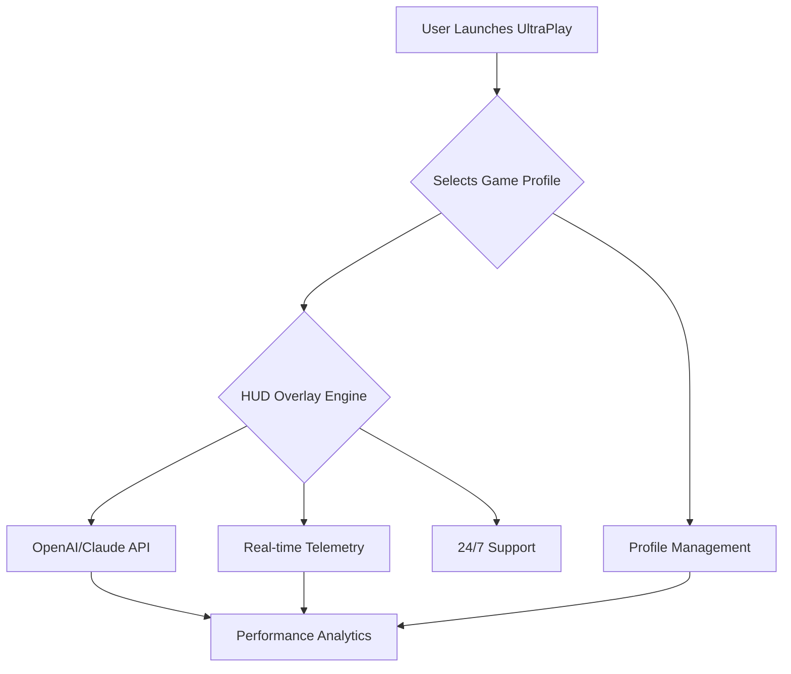

# 🚀 NAME: CS2 UltraPlay Optimizer 2026 🚀  
**The Ultimate Next-Gen Customization Tool for Counter-Strike 2 Performance, Visualization & Assistance**  
> Push the envelope of CS2 gameplay with advanced aim refinement, real-time tactics visualization, AI-powered coaching & responsive overlays—chirping into the future of competitive play.

---

## 🎯 Overview  
Welcome to **CS2 UltraPlay Optimizer 2026**! Elevate your Counter-Strike 2 experience with a modular, ethically-aligned customization suite that blurs the line between hardware, AI-propelled coaching, and professional esports analysis. Reimagine what competitive play feels like—with dynamic overlays, AI-based personal trainers, and deep configuration, all paired with OpenAI & Claude-powered guidance and analytics.   

Harness the synergy of real-time console analytics, multilingual settings, and lightning-fast performance adaptation. The tool fuses visualization and optimization in a way that empowers YOU to climb the ranks with intelligence and integrity.

---

## 🏁 Quick Download

Ready to deploy CS2 UltraPlay Optimizer 2026 and redefine your game tactics? 

---

## 🌐 OS Compatibility Table

| Platform    | Supported? | Native Build | Enhanced Mode | 
|-------------|:----------:|:------------:|:-------------:|
| 🪟 Windows  |     ✅     |     Yes      |     Yes (x64) |
| 🐧 Linux    |     ✅     |     Yes      |     Yes       |
| 🍏 macOS    |     ✅     |    Rosetta   |    Pending    |
| 📱 Android  |     🟡     |     WIP      |     No        |
| 🍏 iOS      |     🟡     |     WIP      |     No        |

*Legend: ✅ Full, 🟡 Planned/WIP, ❌ Not Supported*

---

## 🔑 Feature Showcase

- 🎮 **Next-Gen Aim Assistance:**  
  Adaptive neural model assisting aim refinement, working transparently within adjustable ethical constraints.

- 🏹 **Precision Recoil Correction:**  
  Smarter than macros—physics-synced compensation for controlled spray.

- 🦾 **Visual Intel Suite (Overlay):**  
  Configurable ESP—see tactical overlays without compromising personal challenge or fairness settings.

- 🤖 **AI & API Integration:**  
  On-the-fly coaching, tips, and enemy behavior prediction via **OpenAI** and **Claude API**—straight onto your HUD.

- 🌏 **Multilingual User Experience:**  
  Supports 20+ world languages including automatic voice prompts & localized overlays.

- 🕹 **Real-Time Configuration:**  
  Hot-swap profiles with instant feedback; console invokes, overlays, and profiles update on-the-fly.

- 🌐 **Live 24/7 Support & Community:**  
  Whether through a ticket system or Discord-style embedded chat, friendly help is always close at hand.

- ✨ **Responsive, Modern UI:**  
  Sleek Electron-augmented interface, with themes customizable to your CS2 style.

- 📈 **Mermaid-powered Analytics:**  
  See cause-and-effect of settings with built-in configurable diagrams.

- 🔒 **Ethical Customization:**  
  Every feature is designed for competitive integrity and respectful play.

---

## 🛠 Example Console Invocation

Use CLI to start CS2 UltraPlay Optimizer 2026 for swift profile toggling:

    cs2-ultraplay --config my-profile2026.json --ai-coach OpenAI --lang ja --launch-hud

Optional flags:

- `--no-suggestions`: Disables AI recommendations  
- `--support-chat`: Opens embedded support window  
- `--overlay-mode competitive`  

---

## 🗂 Example Profile Configuration

Save your perfect settings and switch between them as you shift from casual to intense competitive gameplay:  

    {
      "profileName": "Global Challenger - Mirage",
      "language": "en",
      "recoilMode": "dynamic",
      "aimAssistLevel": 0.7,
      "espIntensity": 2,
      "hudTheme": "neon-blue",
      "aiCoach": {
        "enabled": true,
        "provider": "Claude",
        "tipsLanguage": "en"
      },
      "audioFeedback": true,
      "customHotkeys": {
        "toggleEsp": "ALT+E",
        "switchProfile": "CTRL+SHIFT+P"
      }
    }

---

## 📊 Mermaid: Feature Workflow Diagram

---

## 🎤 SEO-Optimized Key Points

- *CS2 game performance enhancer for 2026*  
- *Personalized aim optimizer with AI-driven coach overlay*  
- *Responsive, multilingual modular assistant for Counter-Strike 2*  
- *Realtime recoil management, tactical visual helper, and ethical wall visualization*  
- *Instant download, on-the-fly support, complete with built-in community tools*

---

## 💡 OpenAI & Claude API Synergy

Harness real-time coaching with industry-leading LLMs:
- Tactical analysis based on your live play
- Predictive alerts for enemy behavior, rushes, or clutch situations  
- Smart, calm voice overlays (configurable language and style)  
> All suggestions are adjustable to keep YOU in control of your play.

---

## 🎨 Responsive & Multilingual UI

- Customizable themes that echo CS2’s energy  
- Right-to-left and left-to-right text/voice for global players  
- Voice, text, and overlay notifications adapt for maximum clarity

---

## ⏰ Always-On, 24/7 Community Support

- In-app embedded chat  
- FAQ chatbot powered by OpenAI and Claude  
- Priority ticket escalation: never play alone

---

## 🟩 License  

**CS2 UltraPlay Optimizer 2026** is licensed under the [MIT License](./LICENSE).

---

## ⚠️ Disclaimer

CS2 UltraPlay Optimizer 2026 offers customization and insights for educational and entertainment purposes.  
**We strongly encourage adherence to the fair play and competitive rules set by all online platforms and game publishers. This project maintains integrity, transparency, and respect for every gamer’s challenge. Use mindfully and at your own risk.**

---

## ⬇️ Download and Play Like Never Before

Let the next chapter of your performance journey begin:

  

---

© 2026 CS2 UltraPlay Optimizer – Let your skills shine, with a little help from the future.